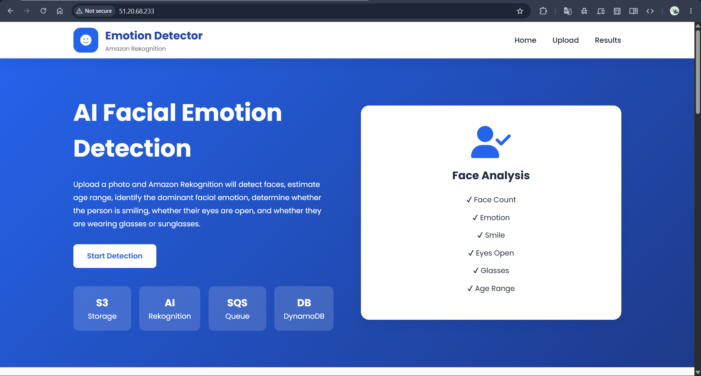
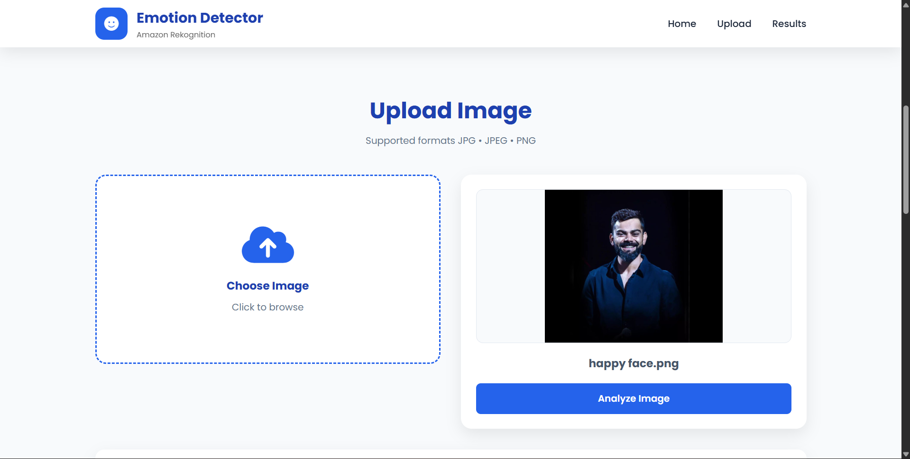
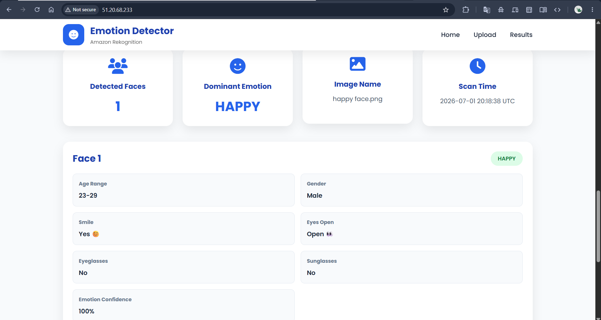

# 😊 AI Facial Emotion Detection using Amazon Rekognition

An AWS Serverless application that detects facial attributes from uploaded images using **Amazon Rekognition**. Users can upload an image through a web interface, and the application analyzes every detected face to identify emotions, age range, smile, eye status, eyeglasses, sunglasses, and gender. The processed results are stored in **Amazon DynamoDB** and displayed on the frontend.

---

## 📌 Project Overview

This project demonstrates an event-driven serverless architecture on AWS.

### Workflow

1. User uploads an image from the web application.
2. API Gateway invokes a Lambda function to generate a pre-signed S3 upload URL.
3. The image is uploaded directly to Amazon S3.
4. An S3 event triggers the Face Analyzer Lambda.
5. Amazon Rekognition analyzes all faces in the image.
6. The analysis results are sent to Amazon SQS.
7. The Result Processor Lambda reads messages from SQS.
8. Processed data is stored in Amazon DynamoDB.
9. The frontend fetches the latest analysis results using the Results API.

---

## 🚀 Features

- Upload facial images
- Detect multiple faces
- Detect dominant emotion
- Estimate age range
- Detect gender
- Detect smile
- Detect eye status
- Detect eyeglasses
- Detect sunglasses
- Display confidence score
- Store analysis results in DynamoDB
- Fully serverless AWS architecture

---

## 🛠️ AWS Services Used

- Amazon API Gateway
- AWS Lambda
- Amazon S3
- Amazon Rekognition
- Amazon SQS
- Amazon DynamoDB

---

## 💻 Technologies Used

### Frontend

- HTML5
- CSS3
- JavaScript

### Backend

- Python
- Boto3

### Cloud

- AWS Lambda
- Amazon S3
- Amazon Rekognition
- Amazon SQS
- Amazon DynamoDB
- API Gateway

---

# 📷 Application Screenshots

## Home Page



---

## Upload Image



---

## Detection Results



---

# 📂 Project Structure

```text
AI-Facial-Emotion-Detection
│
├── frontend
│   ├── index.html
│   ├── style.css
│   └── script.js
│
├── lambda
│   ├── facial-emotion-face-analyzer.py
│   ├── facial-emotion-result-processor.py
│   └── facial-emotion-upload-url-generator.py
│
├── screenshots
│   ├── home-page.png
│   ├── upload-page.png
│   └── results-page.png
│
└── README.md
```

---

# ⚙️ AWS Architecture

```text
                User
                 │
                 ▼
          Web Application
                 │
                 ▼
           API Gateway
                 │
                 ▼
      Upload URL Lambda
                 │
                 ▼
            Amazon S3
                 │
         Object Created Event
                 │
                 ▼
      Face Analyzer Lambda
                 │
                 ▼
      Amazon Rekognition
                 │
                 ▼
            Amazon SQS
                 │
                 ▼
   Result Processor Lambda
                 │
                 ▼
        Amazon DynamoDB
                 │
                 ▼
        Results API Lambda
                 │
                 ▼
         Web Application
```

---


# 📊 Detected Attributes

The application detects the following facial attributes:

- Face Count
- Dominant Emotion
- Emotion Confidence
- Age Range
- Gender
- Smile Detection
- Eyes Open Status
- Eyeglasses Detection
- Sunglasses Detection

---

# ▶️ How to Run

### Frontend

1. Open the `frontend` folder.
2. Update the API Gateway URL inside `script.js`.
3. Open `index.html` in your browser.

### Backend

Deploy the Lambda functions:

- facial-emotion-upload-url-generator.py
- facial-emotion-face-analyzer.py
- facial-emotion-result-processor.py

Configure:

- Amazon S3 Bucket
- Amazon Rekognition
- Amazon SQS Queue
- Amazon DynamoDB Table
- API Gateway

---

# 🎯 Learning Outcomes

Through this project, I learned:

- Building Serverless Applications on AWS
- Using Amazon Rekognition for AI-based facial analysis
- Generating S3 Pre-signed URLs
- Event-driven architecture with Amazon S3
- Asynchronous processing using Amazon SQS
- Data persistence with Amazon DynamoDB
- Building REST APIs with API Gateway
- Integrating frontend applications with AWS services

---

# 👨‍💻 Author

**Harshal Borse**

GitHub: https://github.com/harshal-borse26